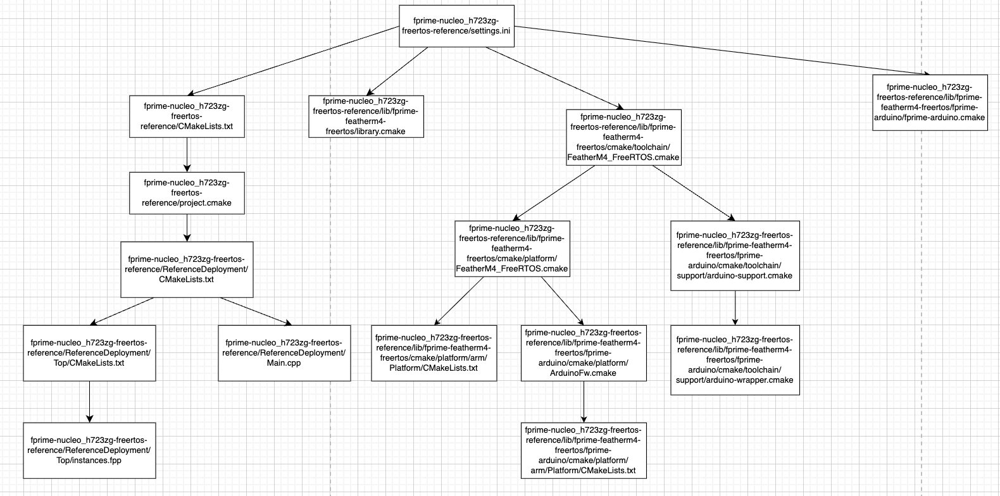
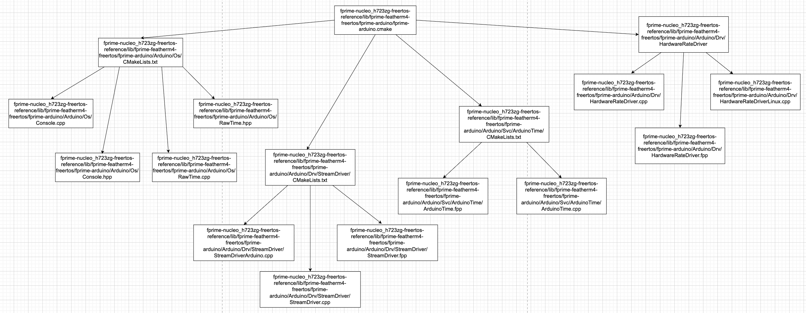

# Arduino Documentation

## Arduino build hierarchy
### Build Hierarchy Excluding Files Targetted by fprime-arduino.cmake

### Build Hierarchy for Files Targetted by fprime-arduino.cmake


## From the root of the fprime project
### /fprime-nucleo_h723zg-freertos-reference/settings.ini
```sh
project_root: .
library_locations: ./lib/fprime-featherm4-freertos:./lib/fprime-featherm4-freertos/fprime-arduino:./lib/fprime-featherm4-freertos/fprime-freertos
default_toolchain: FeatherM4_FreeRTOS
```
- library_locations provides the path to multiple submodules. In the root of each of these submodules, there are cmake files. Providing the paths to library_locations signals fprime to run cmake files at the root of each of these paths. This should be fact checked to make sure library_locations provides this functionality. The cmake files in fprime-featherm4-freertos and fprime-arduino interacts with arduino. Further information on these cmake files are mentioned in the appropriate sections
- default_toolchain targets fprime-nucleo_h723zg-freertos-reference/lib/fprime-featherm4-freertos/cmake/toolchain/FeatherM4_FreeRTOS.cmake as the toolchain file to run which interacts with arduino. Further information on these cmake files are mentioned in the appropriate sections

### /fprime-nucleo_h723zg-freertos-reference/CMakeLists.txt
```sh
include("${CMAKE_CURRENT_LIST_DIR}/project.cmake")
```
- Runs project.cmake

### /fprime-nucleo_h723zg-freertos-reference/project.cmake
```sh
add_fprime_subdirectory("${CMAKE_CURRENT_LIST_DIR}/ReferenceDeployment/")
```
- Runs the cmake file /fprime-nucleo_h723zg-freertos-reference/ReferenceDeployment/CMakeLists.txt

### /fprime-nucleo_h723zg-freertos-reference/ReferenceDeployment/CMakeLists.txt
```sh
finalize_arduino_executable()
```
- Runs this arduino cmake function which seems to provide the arduino API functions for programming in an arduino way

### /fprime-nucleo_h723zg-freertos-reference/ReferenceDeployment/Main.cpp
```sh
# provided description
//  main program for the F' application. Uses the Arduino-style
//  execution with a setup and loop function. The loop function
//  is not used since we allow the FreeRTOS scheduler to take over
//  before it is invoked.
```
- Main.cpp also uses arduino console features

### /fprime-nucleo_h723zg-freertos-reference/ReferenceDeployment/Top/instances.fpp
```sh
  instance comDriver: Arduino.StreamDriver base id 0x4000

  instance timeHandler: Arduino.ArduinoTime base id 0x4400

  instance rateDriver: Arduino.HardwareRateDriver base id 0x4900
```
- Creates these instances as passive components, meaning they run continuously in the backgroun based on a rate group
- Arduino.SteamDriver: Facilitates stream of communication between device and flight software. This stream of communication goes both ways
- Arduino.ArduinoTime: Provides a time service. For instance, it can retrieve the current time.
- Arduino.HardwareRateDriver: Provides a way to configure how frequently a rate group runs.
- Rate groups are groups of tasks categorized based on how frequently they are expected to run

## From the root of the fprime-featherm4-freertos

### /fprime-featherm4-freertos-reference/lib/fprime-featherm4-freertos/library.cmake
```sh
include_directories(
    ${ARDUINO_LIB_PATH}/Time
    ${ARDUINO_LIB_PATH}/STM32duino_FreeRTOS/src
    ${ARDUINO_STM32_LIB_PATH}/libraries/Wire/src
    ${ARDUINO_STM32_LIB_PATH}/libraries/SPI/src
)
```
- Globally includes path to the header files for arduino libraries. This means throughout any part of the project after this function is ran, if a file needs to include functions from a header file within any of these directories, only the path relative to the paths provided in include_directories is needed in the #include line


### /fprime-featherm4-freertos-reference/lib/fprime-featherm4-freertos/cmake/toolchain/FeatherM4_FreeRTOS.cmake
```sh
set(ARDUINO_FQBN "STMicroelectronics:stm32:Nucleo_144:pnum=NUCLEO_H723ZG,upload_method=swdMethod")
```
- Defines what board is being used in stm32duino. This select the nucleo_h723zg board. First stored in a variable ARDUINO_FQBN to be later used in an arduino cmake function called arduino_set_build_settings() to tell stm32duino to select the board configurations for nucleo_h723zg.

```sh
add_compile_options(
    -D_BOARD_NUCLEO_H723ZG
    -DVARIANT_H=\"variant_NUCLEO_H723ZG.h\"
    -DUSE_BASIC_TIMER
)
```
- D_BOARD_NUCLEO_H723ZG: Defines a macro. Does not seemed to be used anywhere. Removing the define option for this macro does not break the build, so we might be able to ignore it.
- DVARIANT_H: This line selects the specific board description file provided in stm32duino. This is that file: https://github.com/stm32duino/Arduino_Core_STM32/blob/main/variants/STM32H7xx/H723Z(E-G)T_H730ZBT_H733ZGT/variant_NUCLEO_H723ZG.h

```sh
set(FPRIME_PLATFORM "FeatherM4_FreeRTOS")
```
- This targets fprime-nucleo_h723zg-freertos-reference/lib/fprime-featherm4-freertos/cmake/toolchain/FeatherM4_FreeRTOS.cmake as the target platform

```sh
set(ARDUINO_SUPPORT_DIR "${CMAKE_CURRENT_LIST_DIR}/../../fprime-arduino/cmake/toolchain/support")
include("${ARDUINO_SUPPORT_DIR}/arduino-support.cmake")
```
- Targets a cmake file that provides a list of arduino cmake functions and provides build flags specific to our board. More information on this file will be provided in its section

```sh
target_use_arduino_libraries("STM32FreeRTOS")
```
- Provides arduino libraries specific for stm32 and freeRTOS

```sh
set(ARDUINO_BUILD_PROPERTIES
    "compiler.c.extra_flags=-DINCLUDE_xSemaphoreGetMutexHolder=1"
    "compiler.cpp.extra_flags=-DINCLUDE_xSemaphoreGetMutexHolder=1"
)
```
- Makes the FreeRTOS function xSemaphoreGetMutexHolder() available to use. The function checks which tasks holds the mutex that's passed as an argument

### /fprime-nucleo_h723zg-freertos-reference/lib/fprime-featherm4-freertos/cmake/platform/FeatherM4_FreeRTOS.cmake
```sh
if(NOT DEFINED ARDUINO_FQBN)
    message(FATAL_ERROR "Must defined arduino FQBN")
elseif(CMAKE_SYSTEM_PROCESSOR STREQUAL "arm")
    set(ARDUINO_TYPES_DIR "${FPRIME_PROJECT_ROOT}/lib/fprime-featherm4-freertos/cmake/platform/arm/Platform") 
else()
    set(ARDUINO_TYPES_DIR "${FPRIME_PROJECT_ROOT}/lib/fprime-featherm4-freertos/cmake/platform/basic/Platform")
endif()

add_fprime_subdirectory("${ARDUINO_TYPES_DIR}")
```
- Both ARDUINO_FQBN is intialized and CMAKE_SYSTEM_PROCESSOR is set to "arm" in /fprime-featherm4-freertos-reference/lib/fprime-featherm4-freertos/cmake/toolchain/FeatherM4_FreeRTOS.cmake so the elseif branch runs which targets fprime-nucleo_h723zg-freertos-reference/lib/fprime-featherm4-freertos/cmake/platform/arm/Platform. The cmake file at the root of this path is run

```sh
set(FPRIME_PLATFORM "ArduinoFw")
```
- This seems to target fprime-nucleo_h723zg-freertos-reference/lib/fprime-featherm4-freertos/fprime-arduino/cmake/platform/ArduinoFw.cmake as the target platform

```sh
include_directories("${FPRIME_PROJECT_ROOT}/lib/fprime-featherm4-freertos/fprime-arduino/Arduino")
```
- Globally includes path to a list of directories that provide a variety of Arduino features

```sh
set(CMAKE_EXECUTABLE_SUFFIX "${FPRIME_ARDUINO_EXECUTABLE_SUFFIX}" CACHE INTERNAL "" FORCE)
```
- Sets CMAKE_EXECUTABLE_SUFFIX to .elf since that is arduino's executable file type

### fprime-nucleo_h723zg-freertos-reference/lib/fprime-featherm4-freertos/cmake/platform/arm/Platform/CMakeLists.txt
```sh
register_fprime_config(
    AUTOCODER_INPUTS
        "${CMAKE_CURRENT_LIST_DIR}/PlatformTypes.fpp"
    HEADERS
        "${CMAKE_CURRENT_LIST_DIR}/PlatformTypes.h"
    CHOOSES_IMPLEMENTATIONS
        Os_File_Stub
        Os_Generic_PriorityQueue
        Os_Mutex_FreeRTOS
        Os_Cpu_Stub
        Os_Memory_Stub
        Os_Task_FreeRTOS
        Os_Console_Arduino
        Os_RawTime_Arduino
        Fw_StringFormat_snprintf
    INTERFACE # No buildable files generated
)
```
- Chooses implementations for Os_Console_Arduino and Os_RawTime_Arduino. 
- OS_Console_Arduino: Provides basic stub implementation for console interaction, such as printing messages
- OS_RawTime_Arduino: Provides features for time, such as retrieving the current time and calculating time intervals

## From the root of fprime-arduino

### fprime-nucleo_h723zg-freertos-reference/lib/fprime-featherm4-freertos/fprime-arduino/fprime-arduino.cmake
```sh
add_fprime_subdirectory("${CMAKE_CURRENT_LIST_DIR}/Arduino/config")
add_fprime_subdirectory("${CMAKE_CURRENT_LIST_DIR}/Arduino/Os")
add_fprime_subdirectory("${CMAKE_CURRENT_LIST_DIR}/Arduino/Drv/GpioDriver")
add_fprime_subdirectory("${CMAKE_CURRENT_LIST_DIR}/Arduino/Drv/StreamDriver")
add_fprime_subdirectory("${CMAKE_CURRENT_LIST_DIR}/Arduino/Drv/I2cDriver")
add_fprime_subdirectory("${CMAKE_CURRENT_LIST_DIR}/Arduino/Drv/I2cNodeDriver")
add_fprime_subdirectory("${CMAKE_CURRENT_LIST_DIR}/Arduino/Drv/SpiDriver")
add_fprime_subdirectory("${CMAKE_CURRENT_LIST_DIR}/Arduino/Drv/PwmDriver")
add_fprime_subdirectory("${CMAKE_CURRENT_LIST_DIR}/Arduino/Drv/TcpClient")
add_fprime_subdirectory("${CMAKE_CURRENT_LIST_DIR}/Arduino/Drv/TcpServer")
add_fprime_subdirectory("${CMAKE_CURRENT_LIST_DIR}/Arduino/Drv/HardwareRateDriver")
add_fprime_subdirectory("${CMAKE_CURRENT_LIST_DIR}/Arduino/Drv/AnalogDriver")
add_fprime_subdirectory("${CMAKE_CURRENT_LIST_DIR}/Arduino/Svc/LifeLed")
add_fprime_subdirectory("${CMAKE_CURRENT_LIST_DIR}/Arduino/Svc/ArduinoTime")
add_fprime_subdirectory("${CMAKE_CURRENT_LIST_DIR}/Arduino/Svc/Ports")
```
- Targets the cmake file present at the root of each path. 
- Our current fprime project uses Arduino/Drv/StreamDrive, Arduino/Svc/ArduinoTime, and Arduino/Drv/HardwareRateDriver. These components are used in /fprime-nucleo_h723zg-freertos-reference/ReferenceDeployment/Top/instances.fpp and are created as passive components.
- Our fprime project also uses /Arduino/OS to provide the arduino implementations OS_Console_Arduino and OS_RawTime_Arduino in fprime-nucleo_h723zg-freertos-reference/lib/fprime-featherm4-freertos/cmake/platform/arm/Platform/CMakeLists.txt

### fprime-nucleo_h723zg-freertos-reference/lib/fprime-featherm4-freertos/fprime-arduino/cmake/platform/ArduinoFw.cmake
```sh
if(NOT DEFINED ARDUINO_FQBN)
    message(FATAL_ERROR "Must defined arduino FQBN")
elseif(CMAKE_SYSTEM_PROCESSOR STREQUAL "arm")
    set(ARDUINO_TYPES_DIR "${CMAKE_CURRENT_LIST_DIR}/arm/Platform")
else()
    set(ARDUINO_TYPES_DIR "${CMAKE_CURRENT_LIST_DIR}/basic/Platform")
endif()
add_fprime_subdirectory("${ARDUINO_TYPES_DIR}")
```
- ARDUINO_FQBN is defined and CMAKE_SYSTEM_PROCESSOR is set to "arm" so the elseif branch runs which targets fprime-nucleo_h723zg-freertos-reference/lib/fprime-featherm4-freertos/fprime-arduino/cmake/platform/arm/Platform. The cmake file at the root of this path is run

### fprime-nucleo_h723zg-freertos-reference/lib/fprime-featherm4-freertos/fprime-arduino/cmake/platform/arm/Platform/CMakeLists.txt
```sh
register_fprime_config(
    AUTOCODER_INPUTS
        "${CMAKE_CURRENT_LIST_DIR}/PlatformTypes.fpp"
    HEADERS
        "${CMAKE_CURRENT_LIST_DIR}/PlatformTypes.h"
    CHOOSES_IMPLEMENTATIONS
        Os_File_Stub
        Os_Generic_PriorityQueue
        Os_Mutex_Stub
        Os_Cpu_Baremetal
        Os_Memory_Baremetal
        Os_Task_Baremetal
        Os_Console_Arduino
        Os_RawTime_Arduino
        Fw_StringFormat_snprintf
    INTERFACE # No buildable files generated
)
```
- Chooses implementations for Os_Console_Arduino and Os_RawTime_Arduino. Refer to fprime-nucleo_h723zg-freertos-reference/lib/fprime-featherm4-freertos/cmake/platform/arm/Platform/CMakeLists.txt for a brief description of these implementations

### fprime-nucleo_h723zg-freertos-reference/lib/fprime-featherm4-freertos/fprime-arduino/cmake/toolchain/support/arduino-support.cmake
- This cmake file provides a list of arduino cmake functions
```sh
set_arduino_build_settings()
```
- This function is run which determines the settings/flags for the compiler and linker
- Uses ARDUINO_FQBN set in /fprime-featherm4-freertos-reference/lib/fprime-featherm4-freertos/cmake/toolchain/FeatherM4_FreeRTOS.cmake to retrieve board build configurations specific to nucleo_h723zg and make it available to the entire cmake build system
- The variables listed in this function stores compiler flags and general compiler information 

```sh
include("${CMAKE_CURRENT_LIST_DIR}/arduino-wrapper.cmake")
```
- Targets a cmake file to provide more arduino cmake functions

### fprime-nucleo_h723zg-freertos-reference/lib/fprime-featherm4-freertos/fprime-arduino/Arduino/Os/CMakeLists.txt
```sh
register_os_implementation("Console" Arduino)
register_os_implementation("RawTime" Arduino)
```
- Allows Console.cpp and Console.hpp, which is in the same directory as this cmake file, to be represented as the implementation Os_Console_Arduino
- Allows RawTime.cpp and RawTime.hpp, which is also in the same directory as this cmake file, to be represented as implementation Os_Console_RawTime
- Both of these implementations are used in fprime-nucleo_h723zg-freertos-reference/lib/fprime-featherm4-freertos/fprime-arduino/cmake/platform/arm/Platform/CMakeLists.txt and fprime-nucleo_h723zg-freertos-reference/lib/fprime-featherm4-freertos/cmake/platform/arm/Platform/CMakeLists.txt
- Os_Console_Arduino provides basic stub implementation for console interaction like printing messages
- Os_RawTime_Arduino provides features for time, such as retrieving the current time and calculating time intervals

### fprime-nucleo_h723zg-freertos-reference/lib/fprime-featherm4-freertos/fprime-arduino/Arduino/Drv/StreamDriver/CMakeLists.txt
```sh
set(SOURCE_FILES
  "${CMAKE_CURRENT_LIST_DIR}/StreamDriver.fpp"
  "${CMAKE_CURRENT_LIST_DIR}/StreamDriver.cpp"
  "${CMAKE_CURRENT_LIST_DIR}/StreamDriverArduino.cpp"
)

register_fprime_module()
```
- Converts StreamDriver.fpp, StreamDriver.cpp, and StreamDriverArduino.cpp into a single library called StreamDriver
- This library provides a way to facilitate a stream of communication between the device and the flight software where the communication goes both ways

### fprime-nucleo_h723zg-freertos-reference/lib/fprime-featherm4-freertos/fprime-arduino/Arduino/Svc/ArduinoTime/CMakeLists.txt
```sh
set(SOURCE_FILES
  "${CMAKE_CURRENT_LIST_DIR}/ArduinoTime.fpp"
  "${CMAKE_CURRENT_LIST_DIR}/ArduinoTime.cpp"
)
target_use_arduino_libraries("TimeLib")

register_fprime_module()
```
- Converts ArduinoTime.fpp and ArduinoTime.cpp into a single library called ArduinoTime. This library provides a time service, such as retrieving time and setting time intervals
- target_use_arduino_libraries(“TimeLib”): Includes libraries that ArduinoTime most likely depends on to be implemented

### fprime-nucleo_h723zg-freertos-reference/lib/fprime-featherm4-freertos/fprime-arduino/Arduino/Drv/HardwareRateDriver/CMakeLists.txt
```sh
set(SOURCE_FILES
  "${CMAKE_CURRENT_LIST_DIR}/HardwareRateDriver.fpp"
  "${CMAKE_CURRENT_LIST_DIR}/HardwareRateDriver.cpp"
)
starts_with(IS_TEENSY "${ARDUINO_FQBN}" "teensy")
starts_with(IS_ATMEGA "${ARDUINO_FQBN}" "MegaCore")

# Check the Linux build
if (NOT FPRIME_ARDUINO)
    list(APPEND SOURCE_FILES "${CMAKE_CURRENT_LIST_DIR}/HardwareRateDriverLinux.cpp")
elseif (IS_TEENSY)
    target_use_arduino_libraries("IntervalTimer")
    list(APPEND SOURCE_FILES "${CMAKE_CURRENT_LIST_DIR}/HardwareRateDriverTeensy.cpp")
elseif (IS_ATMEGA)
    list(APPEND SOURCE_FILES "${CMAKE_CURRENT_LIST_DIR}/../../../ATmega/vendor/libraries/TimerOne/TimerOne.cpp")
    list(APPEND SOURCE_FILES "${CMAKE_CURRENT_LIST_DIR}/HardwareRateDriverAvr.cpp")
else()
    list(APPEND SOURCE_FILES "${CMAKE_CURRENT_LIST_DIR}/HardwareRateDriverBasic.cpp")
endif()
register_fprime_module()
```
- Converts HardwareRateDriver.fpp and HardwareRateDriver.cpp into a library called HardwareRateDriver. HardwareRateDriverBasic.cpp is also added to the library since FPRIME_ARDUINO is set to TRUE in arduino-support.cmake which is part of the build process, and ARDUINO_FQBN is based on stm, not teensy or MegaCore. This library provides a way to configure how frequently a rate group runs

### fprime-nucleo_h723zg-freertos-reference/lib/fprime-featherm4-freertos/fprime-arduino/cmake/toolchain/support/arduino-wrapper.cmake
- Provides a list of arduino cmake functions

## Additional Files
### fprime-nucleo_h723zg-freertos-reference/build-fprime-automatic-FeatherM4_FreeRTOS/build.ninja
- Seems to contain every compiler flag declared throughout the fprime project and stm32duino

